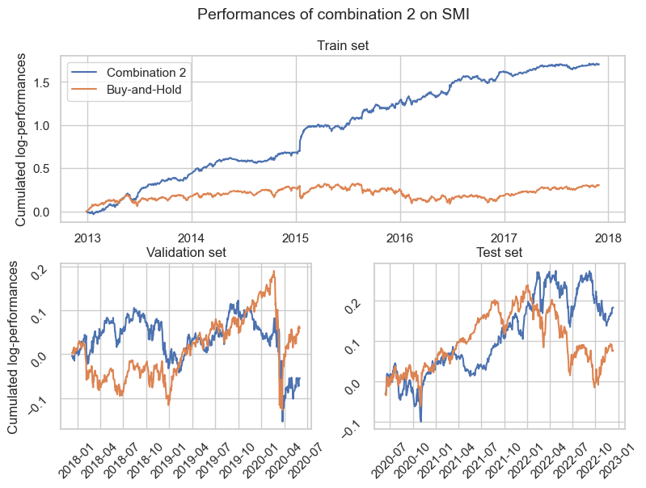

# CS-433: Machine Learning Fall 2022, Project 2 
- Topic: *Machine learning in finance - Forecasting and Trading*
- Team Name: Bogota
- Team Member:
    1. Lelièvre Maxime, **SCIPER: 296777** (maxime.lelievre@epfl.ch)
    2. Peduto Matteo, **SCIPER: 316194** (matteo.peduto@epfl.ch)
    3. Mery Tom, **SCIPER: 297217** (tom.mery@epfl.ch)

* [Getting started](#getting-started)
    * [Project description](#project-description)
    * [Data](#data)
    * [Report](#report)
* [Reproduce results](#reproduce-results)
    * [Requirements](#Requirements)
    * [Repo Architecture](#repo-architecture)
    * [Instructions to run](#instructions-to-run)
* [Results](#results)

# Getting started
This repository contains the codes used to produce the results presented in `report.pdf`
## Project description

Over the last few years, the cryptocurrencies became in-creasingly popular as an investment product and for a portfolio
diversification strategy. A still increasing
body of literature focused on the pertinence of the efficient
market hypothesis (EMH). In essence, the EMH
postulates that efficient markets reflect all past, public or public
and private information in market prices. Verification of the
EMH is important for market participants as it implies that
such information cannot be used to make persistent profits
on trading on the market. 

In this context, we propose, in the continuation of Wildi
et al.(2019), to extend their approachs to other cryptocurrencies
and to commodities and market indices to see weather positive
trading performances can be achieved with forecasting using machine learning
models.

We here implement the following four machine learning methods to forecast the log-returns of several assets:

- Feedforward Neural Network (NN)
- Convolutional Neural Network (CNN)
- Long-Short-Term-Memory (LSTM)
- Random Forest


We further analyze weather the combination of several models
trained on one asset (**combination 1**) gives better results than the results of
the best model only and weather the combination of the best
model trained on different assets of the same type (**combination 2**) gives better results than the results of the best model trained on only one asset of this type. Therefore
we test their performance with several trading performance
metrics.

## Data
The collection of data has been performed on different web sites herafter detailed with the assets’ symbol used in the code:

| Asset type | Asset name | Symbol | Periods | Link |
| -----------| ---------- | ------ | -------------------- |-|
| Crypto-currency| Bitcoin | BTC-USD | 2017-11-09 to 2022-12-13 | [here](https://www.cryptodatadownload.com/data/bitstamp/) 
| Crypto-currency| Ether | ETH-USD | 2017-11-09 to 2022-12-13 | [here](https://www.cryptodatadownload.com/data/bitstamp/) 
| Crypto-currency| Ripple | XRP-USD | 2017-11-09 to 2022-12-13 | [here](https://www.cryptodatadownload.com/data/bitstamp/) 
| Commodity| Gold | LBMA-GOLD | 2012-12-13 to 2022-12-09 | [here](https://data.nasdaq.com/data/LBMA/GOLD-gold-price-london-fixing) 
| Commodity| Natural Gas | NYMEX-NG | 2012-12-13 to 2022-12-09 | [here](https://www.nasdaq.com/market-activity) 
| Commodity| Oil | OPEC-ORB | 2012-12-13 to 2022-12-09 | [here](https://data.nasdaq.com/data/OPEC/ORB-opec-crude-oil-price) 
| Stock market index| S&P500 | SP500 | 2012-12-13 to 2022-12-12| [here](https://www.nasdaq.com/market-activity) 
| Stock market index| SMI | SMI | 2012-12-13 to 2022-12-12| [here](https://finance.yahoo.com/) 
| Stock market index| CAC40 | CAC40 | 2012-12-13 to 2022-12-12| [here](https://finance.yahoo.com/) 

The raw data are already available in the data folder.
## Report
All the details about the choices that have been made and the methodology used throughout this project are available in `report.pdf`. Through this report, the reader is able to understand the different assumptions, decisions and results made during the project. The theoretical background is also explained.
# Reproduce results
## Requirements

- python=3.10.8
- pytorch=1.13.1
- pandas=1.5.2
- scikit-learn=1.1.3
- tqdm=4.64.1
- matplotlib=3.6.2
- seaborn=0.12.1

## Repo Architecture
<pre>  
├─── bestmodels
    ├─── commodities
        ├─── LBMA-GOLD
            ├─── CNN.pkl: Best pre-trained ensemble of 100 CNN. Generated by `src/train.py`
            ├─── LSTM.pkl: Best pre-trained ensemble of 100 LSTM. Generated by `src/train.py`
            ├─── NN.pkl: Best pre-trained ensemble of 100 NN. Generated by `src/train.py`
            ├─── params_CNN.pkl: Number of lags and best learning rate for ensemble of CNN. Generated by `src/validation.py` and loaded by `src/train.py`
            ├─── params_LSTM.pkl: Number of lags and best learning rate for ensemble of LSTM. Generated by `src/validation.py` and loaded by `src/train.py`
            ├─── params_NN.pkl: Number of lags and best learning rate for ensemble of NN. Generated by `src/validation.py` and loaded by `src/train.py`
            ├─── params_RandomForest.pkl: Number of lags and best max features for RandomForest. Generated by `src/validation.py` and loaded by `src/train.py`
        ├─── NYMEX-NG
            ├─── CNN.pkl
            ├─── LSTM.pkl
            ├─── NN.pkl
            ├─── params_CNN.pkl
            ├─── params_LSTM.pkl
            ├─── params_NN.pkl
            ├─── params_RandomForest.pkl
        ├─── OPEC-ORB
            ├─── CNN.pkl
            ├─── LSTM.pkl
            ├─── NN.pkl
            ├─── params_CNN.pkl
            ├─── params_LSTM.pkl
            ├─── params_NN.pkl
            ├─── params_RandomForest.pkl
    ├─── cryptos
        ├─── BTC-USD
            ├─── CNN.pkl
            ├─── LSTM.pkl
            ├─── NN.pkl
            ├─── params_CNN.pkl
            ├─── params_LSTM.pkl
            ├─── params_NN.pkl
            ├─── params_RandomForest.pkl
        ├─── ETH-USD
            ├─── CNN.pkl
            ├─── LSTM.pkl
            ├─── NN.pkl
            ├─── params_CNN.pkl
            ├─── params_LSTM.pkl
            ├─── params_NN.pkl
            ├─── params_RandomForest.pkl
        ├─── XRP-USD
            ├─── CNN.pkl
            ├─── LSTM.pkl
            ├─── NN.pkl
            ├─── params_CNN.pkl
            ├─── params_LSTM.pkl
            ├─── params_NN.pkl
            ├─── params_RandomForest.pkl
    ├─── stock_market_index
        ├─── CAC40
            ├─── CNN.pkl
            ├─── LSTM.pkl
            ├─── NN.pkl
            ├─── params_CNN.pkl
            ├─── params_LSTM.pkl
            ├─── params_NN.pkl
            ├─── params_RandomForest.pkl
        ├─── SMI
            ├─── CNN.pkl
            ├─── LSTM.pkl
            ├─── NN.pkl
            ├─── params_CNN.pkl
            ├─── params_LSTM.pkl
            ├─── params_NN.pkl
            ├─── params_RandomForest.pkl
        ├─── SP500
            ├─── CNN.pkl
            ├─── LSTM.pkl
            ├─── NN.pkl
            ├─── params_CNN.pkl
            ├─── params_LSTM.pkl
            ├─── params_NN.pkl
            ├─── params_RandomForest.pkl
├─── data
    |─── processed
        ├─── commodities
            ├─── LBMA-GOLD
                ├─── test_data.pkl: lags, target and dates of the test set. Generated by `src/process_data.py`
                ├─── train_data.pkl: lags, target and dates of the train set. Generated by `src/process_data.py`
                ├─── val_data.pkl: lags, target and dates of the validation set. Generated by `src/process_data.py`
            ├─── NYMEX-NG
                ├─── test_data.pkl
                ├─── train_data.pkl
                ├─── val_data.pkl
            ├─── OPEC-ORB
                ├─── test_data.pkl
                ├─── train_data.pkl
                ├─── val_data.pkl
        ├─── cryptos
            ├─── BTC-USD
                ├─── test_data.pkl
                ├─── train_data.pkl
                ├─── val_data.pkl
            ├─── ETH-USD
                ├─── test_data.pkl
                ├─── train_data.pkl
                ├─── val_data.pkl
            ├─── XRP-USD
                ├─── test_data.pkl
                ├─── train_data.pkl
                ├─── val_data.pkl
        ├─── stock_market_index
            ├─── CAC40
                ├─── test_data.pkl
                ├─── train_data.pkl
                ├─── val_data.pkl
            ├─── SMI
                ├─── test_data.pkl
                ├─── train_data.pkl
                ├─── val_data.pkl
            ├─── SP500
                ├─── test_data.pkl
                ├─── train_data.pkl
                ├─── val_data.pkl
    |─── raw
        ├─── commodities
            ├─── LBMA-GOLD.csv
            ├─── NYMEX-NG.csv
            ├─── OPEC-ORB.csv
        ├─── cryptos
            ├─── BTC-USD.csv
            ├─── ETH-USD.csv
            ├─── XRP-USD.csv
        ├─── stock_market_index
            ├─── CAC40.csv
            ├─── SMI.csv
            ├─── SP500.csv
├─── notebooks
    ├─── combinations.ipynb: Notebooks assessing performance of model combinations 1 and 2 (see results in `report.pdf`)
    ├─── data_analysis.ipynb: Exploratory data analysis notebooks.
├─── references
    ├─── bitcoin_and_market_inefficiency.pdf
    ├─── project2_description.pdf
├─── src
    ├─── __init__.py: File to define src directory as a python package
    ├─── models.py: File containing definition of the different model's class.
    ├─── process_data.py: File containing implementations to process the raw data.
    ├─── test.py: File to test the pre-trained model.
    ├─── trading_utils.py: File containing useful function for computing trading performence metrics.
    ├─── train.py: File to train the different models with the best parameters.
    ├─── validation.py: File to find the best parameters of the different models.
├─── README.md: README
├─── report.pdf: Report explaining methods and choices that have been made.
├─── requirements.txt: requirements
├─── results.txt: Results in Table II and Table III of `reports.pdf`

</pre>

## Instructions to run 
First make sure to have all the requirements and the data folder in the root.

The following commands give more details about the positional arguments and a description of the process done while running:

```
python process_data.py -h
python validation.py -h
python train.py -h
python test.py -h
```
Please run them before running the following. The commands showed bellow have to be executed in the same order to keep consistency.

The processed data can be reproduced from the raw data by moving to the `src/` folder and execute:
```
python process_data.py dataset nb_lags train_ratio
````

To run the optimization on the validation set move to the `src/` folder and execute:
```
python validation.py model_type dataset
```
Beware that optimizing one model type on one dataset takes from 1min to 8 min (depending on the model) on Google Colab with GPU availability.

To train the models with the best parameters found during the validation move to the `src/` folder and execute:
```
python train.py model_type dataset
```

To test the performances of the trained models move to the `src/` folder and execute:
```
python test.py model_type dataset
````
# Results

### Hit-Rate comparison for each asset
|          | B&H |  NN                     | CNN                    | LSTM  | RF | C1            | C2
|-------------------|------------|-------|---------------------------------|---------------------------------|----------------|-------------|------------------------|
| Bitcoin  | 0.473      | 0.457 | 0.446                           | 0.479                  | 0.459          | 0.451       | `0.505`
| Ethereum | 0.490      | 0.457 | 0.490                  | 0.481                           | 0.475          | 0.488       | `0.497`
| Ripple   | 0.490      | 0.497 | 0.497                           | `0.532` | 0.470          | 0.514       | 0.525
| Nat. gas | 0.516      | 0.518 | `0.519` | 0.494                           | 0.498          | 0.505       | 0.502
| Gold     | 0.493      | 0.502 | 0.511                           | 0.477                           | 0.512 | 0.509       | `0.514`
| Oil      | 0.562      | 0.492 | 0.508                           | 0.527                  | 0.522          | 0.525       | `0.536`
| SP&500    |  0.564 | 0.553                           | 0.554                           | 0.558 | 0.548       | `0.572` | 0.533
| CAC40    | 0.548      | 0.520 | 0.526                           | `0.528` | 0.498          | 0.504       | 0.520
| SMI      | 0.535      | 0.507 | 0.511                  | 0.506                           | 0.488          | 0.517       | `0.546`

### Sharpe ratio comparison for each asset
|          | B&H | NN                     | CNN                    | LSTM  | RF | C1           | C2 |
|-------------------|------------|--------|---------------------------------|---------------------------------|----------------|-------------|------------------------|
| Bitcoin  | -1.163     | -0.981 | -2.066                          | -0.140                | -2.020         | -1.856      | `0.413` |
| Ethereum | -0.870     | -0.560 | -0.327                          | `1.123` | 0.245          | 0.308       | -0.404                 |
| Ripple   | -0.947     | -0.143 | 0.521                           | 1.191                  | -1.453         | 0.531       | `1.497` |
| Nat. gas | 0.743      | 0.523  | `1.107` | -0.308                          | 0.352          | 0.577       | 0.615                  |
| Gold     | 0.034      | -0.056 | -0.960                          | -0.468                          | 0.305 | -0.390      | `0.596` |
| Oil      | 0.686      | 0.389  | 0.652                           | 0.994                           | 1.012 | 0.810       | `1.049` |
| S&P500      | 0.518  | 0.833                  | 0.801                           | 0.768          | 0.090       | `1.136` | 0.551       |
| CAC40    | 0.597      | -0.192 | `0.702` | 0.499                           | -0.674         | 0.169       | 0.685                  |
| SMI      | 0.219      | -0.588 | -0.321                 | -0.367                          | -0.805         | -0.400      | `0.522` |

<pre>
</pre>
